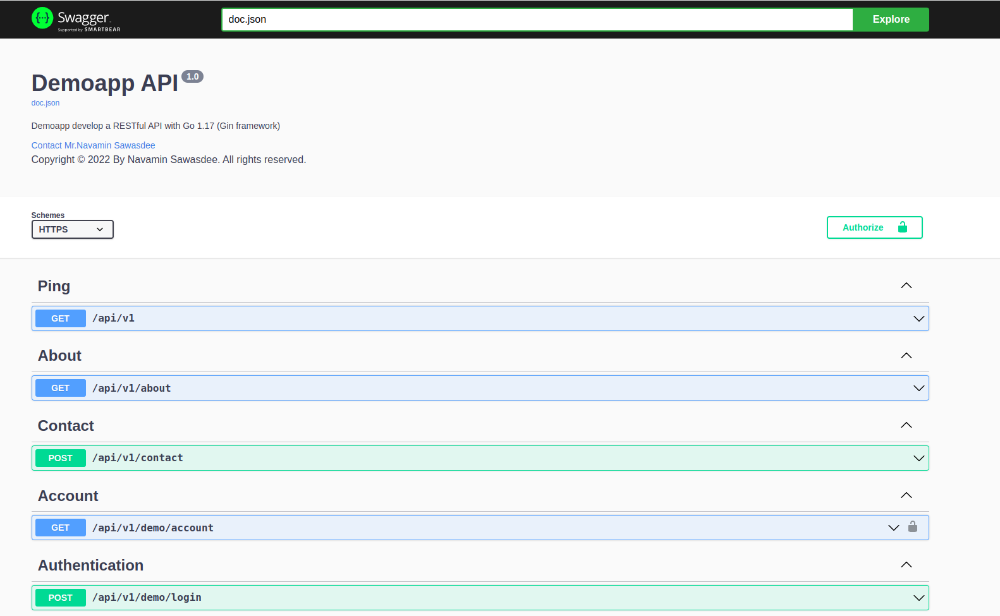

# SUMMARY

Hello,I'm <b>Navamin Sawasdee</b> you can call me <b>Jane</b>
I’m developer with 5+ years of experience in designing and developing user interfaces. I started programming in PHP but I enjoy Golang the most.

# RESTful API for Demo App (2022-11-13)

## Releases
* **2022-11-13** V1 Added docker compose and Makefile
* **2022-06-28** V1 Release

# Getting started
To prepare the folder structure
Make workspec folder
```bash
$ mkdir -p bin pkg src
$ cd src
```
### Installing
To install project, you need to clone the project by following command below:

```bash
$ git clone https://<Username>:<Personal access token>@https://github.com/navamin11/Demoapp.git resume
```

### Copy environment file
Copy the template of environment to actual one (we'll use this)
```bash
$ cp .env.example .env
```
# Running project
### Run this command to initialize surrounding program (api, nginx, redis, mysql)
```bash
$ make docker_up
```
# Base URL
* The base URL for Website is: https://localhost
* The base URL for API is: https://localhost/api/v1/*

# Constructing the request
### GET/POST/PUT/PATCH/DELETE request

* **GET/POST/PUT/PATCH/DELETE** requests require JSON payload (application/json).
​
### Request headers (GET/POST/PUT/PATCH/DELETE)
Authentication requires **access token**. Every request to the server must contain the following in the request header:
* **Accept:** `application/json`
* **Content-type:** `application/json`
* **Authorization:** `Bearer {Your access token}`

# API documentation
**Swagger 2.0** is a set of tools around OpenAPI Specification that can help you design, build, document and consume REST APIs.
​
- Supported APIs:
    - `/swagger/index.html`
- Detailed parameters: mandatory or optional, descriptions and examples.
- Detailed responses: description, examples for different status codes and field comments.
- Endpoint Security Type
- Includes Tesnet's base URL for Website.

## How to open Swagger UI
There's several options for the approach: 
​
- **Web Page:**
    - You only have to open: https://localhost/swagger/index.html
​
## Swagger UI Preview
<p align="center"></p>

# Responses codes
Refer to the following descriptions:

Code | Description
------------ | ------------
200 | OK
201 | Created
400 | Bad Request
401 | Unauthorized
422 | Unprocessable Entity